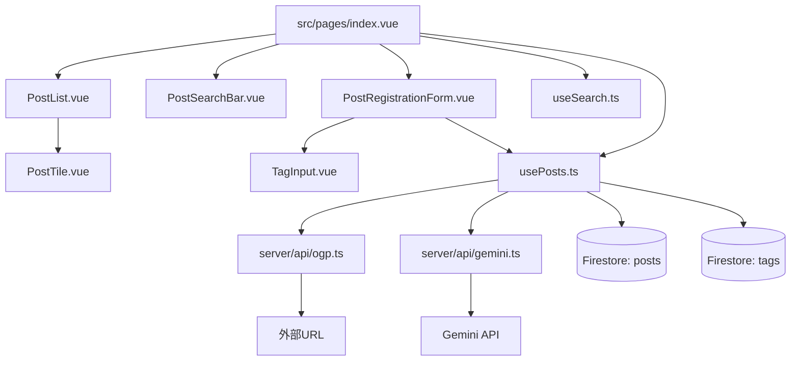

# 設計書 - 投稿一覧・登録機能 (post-management)

## 概要

認証済みユーザーが技術ブログ・XなどのURLを登録し、OGP画像と概要説明をタイル形式で一覧表示するGleanのコア機能。Nuxt server routesでCORSを回避してOGPを取得し、Gemini APIで日本語概要を自動生成する。検索・タグフィルタによって記事を効率的に整理できる。

## コードの再利用分析

### 活用する既存コード

- **`src/plugins/firebase.client.ts`**: Firestoreインスタンス初期化を追加。`useFirebaseDb()`関数を追加してuseAuthの`useFirebaseAuth()`パターンを踏襲
- **`src/composables/useAuth.ts`**: `currentUser`でログインユーザーのUIDを取得。認証状態の確認に使用
- **`src/middleware/auth.client.ts`**: 既存の認証ミドルウェアをindex.vueに適用継続
- **`src/types/auth.ts`**: `UserProfile`型の参照パターンをpost型定義に踏襲
- **`nuxt.config.ts`**: runtimeConfigに追記（Gemini APIキー）

### 統合ポイント

- **Firebase Auth**: `useAuth().currentUser.value?.uid` でUID取得、投稿のオーナーシップ管理
- **Firestore**: `posts`コレクション（新規）と`tags`コレクション（新規）
- **Nuxt Server Routes**: OGPフェッチとGemini API呼び出しのサーバーサイドプロキシ

## アーキテクチャ

SPAのクライアントサイドとNuxt Server Routesを組み合わせた構成。



### モジュール設計原則

- **単一責任**: `usePosts.ts`はCRUD専任、`useSearch.ts`は検索専任
- **サーバー/クライアント分離**: Gemini APIキー・OGPフェッチはserver routesに隔離
- **コンポーネント分離**: タイル・フォーム・検索は独立コンポーネント
- **型安全性**: すべてTypeScript strictモード準拠

## コンポーネントとインターフェース

### `src/types/post.ts`
- **目的:** 投稿機能全体の型定義
- **主要型:**
  ```typescript
  interface Post {
    id: string
    uid: string
    url: string
    title: string
    description: string       // Gemini生成概要
    ogpImageUrl: string | null
    tags: string[]
    createdAt: Timestamp
    updatedAt: Timestamp
  }
  type CreatePostInput = Pick<Post, 'url' | 'title' | 'description' | 'ogpImageUrl' | 'tags'>
  interface OgpData { title: string; description: string; imageUrl: string | null; siteName: string | null }
  interface TagSuggestion { name: string; count: number }
  interface PostErrorMap { [errorCode: string]: string }
  ```

### `src/plugins/firebase.client.ts`（変更）
- **目的:** Firestoreインスタンスの初期化追加
- **追加エクスポート:** `useFirebaseDb(): Firestore`
- **依存:** firebase/firestore の `getFirestore`

### `src/composables/usePosts.ts`
- **目的:** 投稿のCRUD操作とリアルタイム購読
- **状態（ファイルスコープ）:** `posts: Ref<Post[]>`, `isLoading: Ref<boolean>`, `error: Ref<string | null>`
- **インターフェース:**
  ```typescript
  fetchPosts(uid: string): void          // onSnapshotでリアルタイム購読開始
  addPost(url: string, tags: string[]): Promise<string | null>  // postIdを返す
  deletePost(postId: string): Promise<void>
  stopListening(): void
  ```
- **addPostフロー:** `/api/ogp` → `/api/gemini` → `addDoc(posts)` → tags upsert（batch write）
- **依存:** `useFirebaseDb()`, `useAuth()`, `src/types/post.ts`

### `src/composables/useSearch.ts`
- **目的:** クライアントサイドの検索・フィルタリング
- **インターフェース:**
  ```typescript
  // 引数
  (posts: Readonly<Ref<Post[]>>)
  // 戻り値
  keyword: Ref<string>
  activeTags: Ref<string[]>
  filteredPosts: ComputedRef<Post[]>    // keyword + activeTags でAND絞り込み
  availableTags: ComputedRef<string[]>  // 表示中postsから動的生成
  ```
- **検索ロジック:** title + description の小文字部分一致、タグはAND条件

### `server/api/ogp.ts`
- **目的:** OGPメタデータのサーバーサイドフェッチ（CORSバイパス）
- **エンドポイント:** `GET /api/ogp?url=<encoded-url>`
- **処理:** `$fetch`でHTMLを取得 → 正規表現で`og:title/description/image/site_name`を抽出
- **レスポンス:** `OgpData`型
- **エラー:** URLが無効 → 400、フェッチ失敗 → 500

### `server/api/gemini.ts`
- **目的:** Gemini APIによる記事概要の自動生成
- **エンドポイント:** `POST /api/gemini`
- **リクエスト:** `{ url: string; ogTitle: string; ogDescription: string }`
- **処理:** `@google/generative-ai`の`gemini-1.5-flash`でプロンプト実行
- **プロンプト:** 「タイトル・説明・URLをもとに日本語200字以内の要約を生成」
- **レスポンス:** `{ summary: string }`
- **環境変数:** `NUXT_GEMINI_API_KEY`（runtimeConfig privateセクション）

### `src/components/TagInput.vue`
- **目的:** タグの入力補完付き複数選択UI
- **Props:** `modelValue: string[]`, `suggestions: TagSuggestion[]`, `maxTags?: number`（デフォルト10）
- **Emits:** `update:modelValue`
- **依存:** なし（純粋UIコンポーネント）

### `src/components/PostRegistrationForm.vue`
- **目的:** URL入力→OGPプレビュー→Gemini概要確認→保存の登録フロー
- **状態遷移:** `input` → `loading`（OGP+Gemini取得中）→ `preview`（確認画面）→ `saving` → 完了
- **Props:** なし
- **Emits:** `registered: [postId: string]`, `cancel: []`
- **依存:** `usePosts.ts`, `TagInput.vue`

### `src/components/PostTile.vue`
- **目的:** 1記事のタイル表示（OGP画像・タイトル・概要・タグ・削除ボタン）
- **Props:** `post: Post`, `isOwner: boolean`
- **Emits:** `delete: [postId: string]`, `tagClick: [tag: string]`
- **動作:** タイルクリックで`window.open(post.url, '_blank')`

### `src/components/PostList.vue`
- **目的:** PostTileのレスポンシブグリッドコンテナ
- **Props:** `posts: Post[]`, `currentUserId: string | null`
- **Emits:** `deletePost: [postId: string]`, `tagFilter: [tag: string]`
- **レイアウト:** `grid grid-cols-1 sm:grid-cols-2 lg:grid-cols-3 gap-4`

### `src/components/PostSearchBar.vue`
- **目的:** キーワード検索＋タグフィルタのUI
- **Props:** `modelValue: string`, `activeTags: string[]`, `availableTags: string[]`
- **Emits:** `update:modelValue`, `update:activeTags`

### `src/pages/index.vue`（変更）
- **目的:** 全コンポーネント統合のメインページ
- **構成:** ヘッダー（ログアウト）+ 登録ボタン + PostSearchBar + PostList
- **依存:** `usePosts.ts`, `useSearch.ts`, `useAuth.ts`

### `firestore.rules`
- **目的:** Firestoreセキュリティルール
- **posts:** 認証済みなら全件read可、create/update/deleteは自分のuid一致のみ
- **tags:** 認証済みなら読み書き可

## データモデル

### Firestore: `posts/{postId}`

```
id: string (Firestoreドキュメントの自動生成ID)
uid: string (Firebase Auth UID)
url: string (登録元URL)
title: string (OGPタイトル)
description: string (Gemini生成概要、空文字の場合あり)
ogpImageUrl: string | null
tags: string[] (最大10件)
createdAt: Timestamp (serverTimestamp())
updatedAt: Timestamp (serverTimestamp())
```

### Firestore: `tags/{tagName}`

```
name: string (ドキュメントIDと同値)
count: number (使用回数)
updatedAt: Timestamp
```

## エラーハンドリング

### エラーシナリオ

1. **OGP取得失敗**
   - 処理: URLとユーザー入力タイトルのみで登録を続行（`ogpImageUrl: null`, `description: ''`）
   - ユーザー表示: 「OGP情報を取得できませんでした。タイトルを直接入力してください」

2. **Gemini概要生成失敗**
   - 処理: `description: ''`で記事登録は続行（ブロックしない）
   - ユーザー表示: 「概要の自動生成に失敗しました（記事は登録されます）」

3. **重複URL**
   - 処理: Firestoreで`url`フィールドを事前チェック（同uid内）
   - ユーザー表示: 「このURLは既に登録されています」

4. **無効なURL形式**
   - 処理: クライアントサイドバリデーション（`new URL()`試行）
   - ユーザー表示: 「有効なURLを入力してください」

5. **Firestore書き込み失敗**
   - 処理: エラーをerror.valueにセット
   - ユーザー表示: 「保存に失敗しました。もう一度お試しください」

6. **削除権限なし**
   - 処理: クライアントでUID確認 → Firestoreセキュリティルールで二重防御
   - ユーザー表示: 「削除権限がありません」

## テスト戦略

### ユニットテスト（Vitest）

- **`src/composables/__tests__/usePosts.test.ts`**
  - Firestore（addDoc, deleteDoc, onSnapshot）をvi.mockで完全モック
  - `/api/ogp`と`/api/gemini`の`$fetch`をモック
  - `addPost`の成功・OGP失敗・Gemini失敗・重複URLケース
  - `deletePost`の成功・権限なしケース
  - エラーメッセージマッピングのテスト

- **`src/composables/__tests__/useSearch.test.ts`**
  - キーワード検索のフィルタロジック
  - タグAND検索のロジック
  - `availableTags`の動的生成

### 統合テスト

- **`server/api/ogp.test.ts`**（オプション）: 実際のHTTP取得のモック

### E2Eテスト（Playwright）

- **`e2e/posts.spec.ts`**
  - URL登録フロー（成功・OGP失敗・バリデーション）
  - タイル一覧表示
  - キーワード検索・タグフィルタ
  - 記事削除フロー
