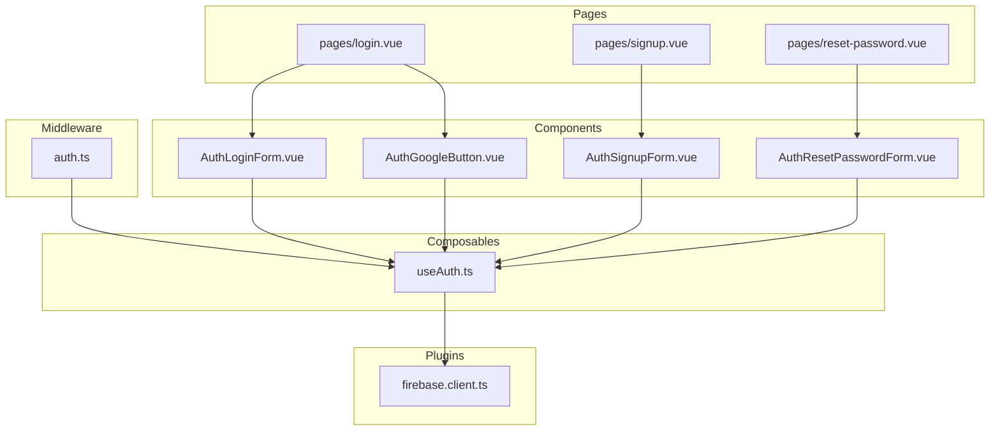

# 設計書: ユーザー認証機能

## 概要

Firebase Authenticationを利用したユーザー認証機能の技術設計。Nuxt 3のミドルウェアとVueのComposablesパターンを活用し、Google認証およびメール/パスワード認証を実装する。認証状態はアプリケーション全体で共有され、ルートガードによる保護されたページへのアクセス制御を行う。アプリケーションはS3静的ホスティングにデプロイするため、すべての処理はクライアントサイドで完結する設計とする。

## ステアリングドキュメントとの整合性

### 技術標準
- Nuxt 3 + Vue 3 + TypeScript 5（strictモード）
- Firebase Authentication SDK v10（モジュラーAPI）
- Tailwind CSSによるUIスタイリング
- Composablesパターンによる状態管理
- S3 + CloudFront による静的ホスティング（SPAモード）

### プロジェクト構造
- CLAUDE.mdのディレクトリ構成に準拠
- `src/composables/` に認証ロジックを配置
- `src/components/` にUIコンポーネントを配置
- `src/types/` に型定義を配置

## コード再利用分析

### 既存コンポーネントの活用
- **Nuxt 3組み込みミドルウェア**: ルートガード実装に`defineNuxtRouteMiddleware`を使用
- **Firebase SDK**: `firebase/auth`モジュールの組み込み関数を最大限活用

### 統合ポイント
- **Firebase Firestore**: ユーザープロファイルデータの永続化
- **Nuxt プラグインシステム**: Firebase初期化とAuth状態リスナーの登録

## アーキテクチャ

認証機能はレイヤードアーキテクチャで構成する。Firebase SDKをラップしたComposableを中心に、UIコンポーネント、ミドルウェア、プラグインが連携する。

### モジュラー設計原則
- **単一ファイル責任**: Firebase初期化、認証ロジック、UIコンポーネントを分離
- **コンポーネント分離**: ログインフォーム、サインアップフォーム、パスワードリセットフォームを個別コンポーネント化
- **サービスレイヤー分離**: Firebase操作はComposableに集約、UIはプレゼンテーションに専念
- **ユーティリティのモジュール化**: バリデーションロジックを独立したユーティリティとして分離



## コンポーネントとインターフェース

### Plugin: `firebase.client.ts`
- **目的:** Firebaseアプリの初期化とAuthインスタンスの提供
- **インターフェース:**
  - `useFirebaseAuth()`: Firebase Authインスタンスを返す
- **依存:** `firebase/app`, `firebase/auth`
- **配置:** `src/plugins/firebase.client.ts`

### Composable: `useAuth.ts`
- **目的:** 認証に関するすべてのロジックとリアクティブ状態を提供
- **インターフェース:**
  - `currentUser: Ref<User | null>` - 現在のユーザー
  - `isAuthenticated: ComputedRef<boolean>` - 認証済みかどうか
  - `isLoading: Ref<boolean>` - 認証状態の読み込み中フラグ
  - `error: Ref<string | null>` - エラーメッセージ
  - `loginWithGoogle(): Promise<void>` - Google認証
  - `loginWithEmail(email: string, password: string): Promise<void>` - メールログイン
  - `signupWithEmail(email: string, password: string): Promise<void>` - メールサインアップ
  - `logout(): Promise<void>` - ログアウト
  - `resetPassword(email: string): Promise<void>` - パスワードリセット
  - `resendVerificationEmail(): Promise<void>` - 確認メール再送
- **依存:** `firebase.client.ts`プラグイン
- **配置:** `src/composables/useAuth.ts`

### Middleware: `auth.client.ts`
- **目的:** 未認証ユーザーの保護ページアクセスをブロック（クライアントサイド専用）
- **インターフェース:** Nuxt routeMiddlewareとして自動適用
- **依存:** `useAuth`コンポーザブル
- **配置:** `src/middleware/auth.client.ts`

### Component: `AuthLoginForm.vue`
- **目的:** メールアドレス/パスワード入力フォームの表示
- **インターフェース:** `emit('success')` - ログイン成功時
- **依存:** `useAuth`
- **配置:** `src/components/AuthLoginForm.vue`

### Component: `AuthSignupForm.vue`
- **目的:** サインアップフォームの表示（バリデーション付き）
- **インターフェース:** `emit('success')` - サインアップ成功時
- **依存:** `useAuth`
- **配置:** `src/components/AuthSignupForm.vue`

### Component: `AuthResetPasswordForm.vue`
- **目的:** パスワードリセットメール送信フォーム
- **インターフェース:** `emit('sent')` - メール送信完了時
- **依存:** `useAuth`
- **配置:** `src/components/AuthResetPasswordForm.vue`

### Component: `AuthGoogleButton.vue`
- **目的:** Googleログインボタンの表示
- **インターフェース:** `emit('success')` - ログイン成功時
- **依存:** `useAuth`
- **配置:** `src/components/AuthGoogleButton.vue`

### Page: `login.vue`
- **目的:** ログインページ（メール認証 + Google認証）
- **依存:** `AuthLoginForm`, `AuthGoogleButton`
- **配置:** `src/pages/login.vue`

### Page: `signup.vue`
- **目的:** サインアップページ
- **依存:** `AuthSignupForm`, `AuthGoogleButton`
- **配置:** `src/pages/signup.vue`

### Page: `reset-password.vue`
- **目的:** パスワードリセットページ
- **依存:** `AuthResetPasswordForm`
- **配置:** `src/pages/reset-password.vue`

## データモデル

### User（Firebase Authentication）
```typescript
// Firebase Authが管理するユーザー情報
interface FirebaseUser {
  uid: string
  email: string | null
  displayName: string | null
  photoURL: string | null
  emailVerified: boolean
  providerId: string
}
```

### UserProfile（Firestore）
```typescript
// Firestoreに保存するユーザープロファイル
interface UserProfile {
  uid: string              // Firebase Auth UID
  email: string            // メールアドレス
  displayName: string      // 表示名
  photoURL: string | null  // プロフィール画像URL
  provider: 'google' | 'email'  // 認証プロバイダー
  createdAt: Timestamp     // 作成日時
  updatedAt: Timestamp     // 更新日時
}
```

### AuthError
```typescript
// 認証エラーのマッピング
interface AuthErrorMap {
  [firebaseErrorCode: string]: string  // Firebase エラーコード → 日本語メッセージ
}
```

## エラーハンドリング

### エラーシナリオ

1. **ネットワークエラー**
   - **ハンドリング:** `auth/network-request-failed`をキャッチし、リトライ可能な状態にする
   - **ユーザー影響:** 「ネットワーク接続を確認してください」と表示

2. **無効なメールアドレス**
   - **ハンドリング:** `auth/invalid-email`をキャッチ
   - **ユーザー影響:** 「有効なメールアドレスを入力してください」と表示

3. **パスワード不一致/弱いパスワード**
   - **ハンドリング:** `auth/weak-password`をキャッチ
   - **ユーザー影響:** 「パスワードは8文字以上で入力してください」と表示

4. **メールアドレス重複**
   - **ハンドリング:** `auth/email-already-in-use`をキャッチ
   - **ユーザー影響:** 「このメールアドレスは既に登録されています」と表示

5. **認証情報不一致**
   - **ハンドリング:** `auth/wrong-password`または`auth/user-not-found`をキャッチ
   - **ユーザー影響:** 「メールアドレスまたはパスワードが正しくありません」と表示（セキュリティのため統一メッセージ）

6. **Googleログインキャンセル**
   - **ハンドリング:** `auth/popup-closed-by-user`をキャッチ
   - **ユーザー影響:** エラー表示なし（ユーザーの意図的な操作）

7. **メール未確認**
   - **ハンドリング:** ログイン成功後に`emailVerified`をチェック
   - **ユーザー影響:** 「メールアドレスの確認が完了していません」と確認メール再送オプションを表示

## デプロイメント: S3静的ホスティング

### Nuxt設定
- `ssr: false` を設定し、SPAモードで動作させる
- `nuxt generate` で静的ファイルを出力する
- Firebase設定値はビルド時に環境変数（`NUXT_PUBLIC_*`）として埋め込む

### S3バケット設定
- 静的ウェブサイトホスティングを有効化
- エラードキュメントに`index.html`を指定（SPAルーティング対応）
- バケットポリシーでCloudFrontからのアクセスのみ許可（OAC使用）

### CloudFront設定
- S3バケットをオリジンとして設定
- カスタムエラーレスポンス: 403/404を`/index.html`（200）にリライト（SPAフォールバック）
- HTTPS強制（ACM証明書を使用）
- カスタムドメイン設定（必要に応じて）

### ミドルウェアの制約
- `auth.ts`ミドルウェアはクライアントサイド専用とする
- ファイル名を`auth.client.ts`とするか、`process.client`ガードを使用する
- サーバーサイドレンダリングは使用しないため、サーバーミドルウェアは不要

### CI/CDパイプライン
```
npm run generate → S3にアップロード → CloudFrontキャッシュ無効化
```

### 環境変数（ビルド時に埋め込み）
```
NUXT_PUBLIC_FIREBASE_API_KEY
NUXT_PUBLIC_FIREBASE_AUTH_DOMAIN
NUXT_PUBLIC_FIREBASE_PROJECT_ID
NUXT_PUBLIC_FIREBASE_STORAGE_BUCKET
NUXT_PUBLIC_FIREBASE_MESSAGING_SENDER_ID
NUXT_PUBLIC_FIREBASE_APP_ID
```

## テスト戦略

### ユニットテスト（Vitest）
- `useAuth`コンポーザブルの各メソッドのテスト
  - ログイン成功/失敗
  - サインアップ成功/失敗（バリデーション含む）
  - ログアウト
  - パスワードリセット
  - 認証状態の変更監視
- エラーメッセージマッピングのテスト
- Firebase Authのモック化

### 統合テスト（Vitest）
- 認証ミドルウェアによるルートガードのテスト
- Firebase初期化プラグインのテスト
- Firestoreへのユーザープロファイル作成フローのテスト

### E2Eテスト（Playwright）
- Google認証フロー（ポップアップ操作）
- メール/パスワードでのサインアップ → メール確認 → ログインの一連のフロー
- パスワードリセットフロー
- 未認証時のリダイレクトフロー
- ログアウトフロー
